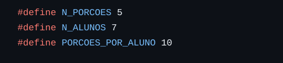

# Problema da alimentação dos selvagens :shallow_pan_of_food:

Este repositório mostra diversas implementações para o problema de alimentação dos selvagens (dining savages problem) como descrito no livro _Little Book of Semaphores_. 

O problema originalmente consiste em: N selvagens famintos, que precisam se alimentar de apenas 1 panela, que é preenchida por 1 único cozinheiro. Para trazer a simulação para um ambiente mais familiar, imaginamos que os selvagens fossem alunos esperando na fila do bandejão esperando uma feijoada 

## Parâmetros de entrada ⚙️

Similar ao que é feito em aula, não recebemos parâmetros do usuário diretamente pelo terminal, mas pelas constantes no início do programa 



Onde N_PORÇÕES nos diz quantas porções o cozinheiro pode colocar por vez na panela, N_ALUNOS quantos alunos vão comer e PORÇÕES_POR_ALUNO quantas vezes cada aluno deve comer antes do programa acabar. 

## Semáforos e variáveis voláteis 🔒

Como no livro, precisamos de 3 semáforos, 2 tradicionais e um mutex. 

Os semáforos tradicionais avisam se a panela está cheia ou vazia e o mutex é o que garante que um aluno pode pegar uma porção da panela, isto é, acessar a região crítica.

A região crítica é defininda pela variável porções, que indica quantas porções existem __atualmente__ na panela.

Também temos a variável volátil acabaram, simplesmente para avisar a thread cozinheiro quando ela deve parar 

## As Threads 🧵

### Alunos 🎓

As threads dos alunos se iniciam e, enquanto não tiverem comido a quantidade desejada de porções, esperam sua vez na fila, ou seja, esperam o mutex 'liberar' a entrada na região crítica. Quando entram, verificam se há comida na panela. Caso não haja, avisam o cozinheiro e esperam ele encher a panela.

Caso haja porções, simplesmente pegam a sua (subtraem 1 de porções) e incrementam 1 do quanto eles já comeram. Após isso, liberam a região crítica e comem (representado por um sleep)

### Cozinheiro 👨‍🍳

O cozinheiro espera até que seja avisado que a panela está vazia. Nesse caso, chama a função putServingsInPot, que coloca N_PORÇÕES em porções. Note que eu não preciso de outro mutex para impedir que os alunos comam quando não há nada na panela pois, nesse momento, o único aluno com acesso a região crítica por meio do mutex está esperando a panela estar cheia para continuar e liberar a região crítica. 


A função auxiliar não era necessária, mas optamos por colocá-la para ficar mais próximo da implementação do livro

O cozinheiro repõe a panela e avisa que ela está cheia. 

No caso em que todos os alunos acabaram, ele simplesmente finaliza sua execução

## Execução geral ⏯️

Primeiramente, criamos a thread de cozinheiros e a iniciamos. Fazemos o mesmo com a thread de alunos. Note que o primeiro aluno irá tentar comer e então irá avisar o cozinheiro para ele encher a panela.

Após todas as threads de alunos terem finalizado, setamos 'acabaram' para 1 e avisamos o cozinheiro que a panela está vazia, mesmo isso não necessariamente sendo verdade. Isso é feito para que o cozinheiro saia do wait e note que os alunos acabaram para finalizar sua execução. 

## Variações com mais parâmetros 🎛️

### N cozinheiros e 1 panela 👨‍🍳👨‍🍳

Nesse caso, mais de um cozinheiro pode repor a panela (o número de cozinheiros também pode ser alterado nas constantes iniciais). A grande mudança da versão original se dá pelo fato de ter mais de uma thread de cozinheiros, além de que, para repor a panela, o cozinheiro soma a quantidade de porções a 0, permitindo que os N cozinheiros reponham. 

Isso é apenas para coerência teórica, já que os semáforos garantem exclusão mútua, então só 1 deles irá repor no código. 

Além disso, não podemos esquecer de, no final da execução, avisar todos os N cozinheiros de que as panelas estão vazias.

### N cozinheiros e N panelas 🍽️🍽️ 

Nesse caso, cada cozinheiro é responsável por 1 panela. Agora precisamos de um vetor de mutex, avisando se cada aluno pode acessar a panela na posição i

Para comer, os alunos checam se podem comer em qualquer uma das panelas. Se o mutex permitir, só então checam se essa panela está vazia ou então podem comer.

A variável volátil porções foi substituída pelo vetor panelas, no qual o cozinheiro i repõe apenas as porções da panela i.


## Interface gráfica 🖥️

A interface gráfica foi desenvolvida utilizando a biblioteca SFML e permite visualizar a execução do problema de sincronização em tempo real. Ela exibe os seguintes elementos:

- Alunos: Representados por sprites, com estados como "esperando", "comendo" ou "finalizado".
- Cozinheiros: Mostrados enquanto estão "cozinhando" ou "descansando".
- Panelas: Indicando a quantidade de porções disponíveis.

### Funcionalidades:
- Atualização em tempo real dos estados dos alunos e cozinheiros.
- Representação visual das ações, como alunos indo até as panelas e cozinheiros reabastecendo.
- Comunicação com o servidor para sincronizar os estados.


## Rodando o programa ▶️ 

Este tutorial foi testado para sistemas com gerenciador de pacotes do Debian. Caso use outra distro, procure instruções de como baixar as dependências corretamente para o seu gerenciador.

Consulte https://www.sfml-dev.org para obter instruções de download específicas, caso necessite.

### Dependências

```bash
sudo apt-get update -y
sudo apt-get install cmake libsfml-dev
```

### Compilando o código
```bash
# Criar pasta de build na raiz
mkdir build
cd build
cmake ..
make
```

### Executando a interface como Servidor
```bash
./exec/sfml_app
```

O sevidor é iniciado e fica aguardando o código em C ser execultado para iniciar a interface. Caso o servidor não inicie, certifique-se que a porta 53002 esteja livre.

```bash
sudo fuser -k 53002/tcp
```

Agora você deve ser capaz de executar o servidor.

### Executando o código 
```bash
./exec/NcozinheirosNpanelas
```

A saída do programa aparecerá no terminal, enquanto uma janela do SFML é aberta para exibição da interface.
